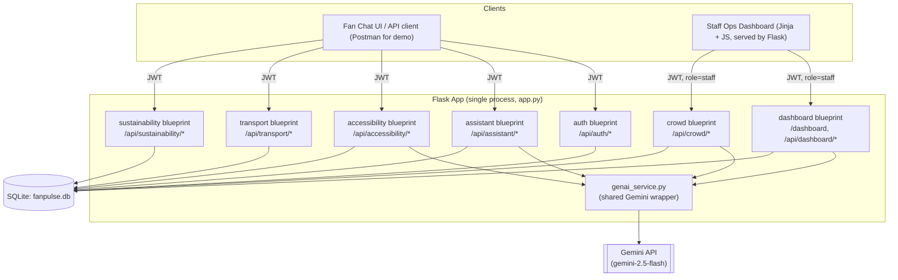

# architecture.md
## FanPulse — GenAI Stadium Operations Platform for FIFA World Cup 2026
### Hack2Skill Prompt Wars — Single Source of Truth for AntiGravity Agents

---

## 0. How Agents Must Use This Document

> **Read this section first. It is a binding constraint, not a suggestion.**

1. **This file is the only context you need.** Do not scan the repository to "understand the project" before starting a task. Every decision — naming, schema, endpoints, folder layout, security rule — is already made below. If something seems missing, re-read §7 (API Contract) and §8 (Data Model) before exploring the filesystem.
2. **Work one task from §12 (Agent Task Board) at a time.** Each task lists the *exact* files you may create or edit. Do not touch files outside your assigned scope — other agents (or a later task) own them.
3. **Do not re-derive architecture decisions.** If a choice looks sub-optimal, implement it as written anyway and leave a one-line `# NOTE:` comment. This is a 36–48 hour hackathon build; consistency beats optimality.
4. **Minimal footprint rule:** one Flask app, one SQLite file, no Docker, no microservices, no message queues. If a task description implies infrastructure not listed in §4, it is out of scope — skip it.
5. **When a task is complete**, run the module's unit tests (§11) before marking it done. Do not proceed to a dependent task if tests fail.

---

## 1. Problem Statement (verbatim, for alignment checks)

> Build a GenAI-enabled solution that enhances stadium operations and the overall tournament experience for fans, organizers, volunteers, or venue staff. The solution must leverage Generative AI to improve navigation, crowd management, accessibility, transportation, sustainability, multilingual assistance, operational intelligence, or real-time decision support during the FIFA World Cup 2026.

## 2. Solution Alignment Matrix

Every module below maps to at least one requirement. Agents implementing a module must not add scope outside its mapped row.

| Problem statement requirement | Module (§6) | Primary user |
|---|---|---|
| Navigation | `assistant` | Fan |
| Crowd management | `crowd` | Organizer / Volunteer |
| Accessibility | `accessibility` | Fan (PRM*) |
| Transportation | `transport` | Fan |
| Sustainability | `sustainability` | Fan / Organizer |
| Multilingual assistance | `assistant` | Fan |
| Operational intelligence | `dashboard` | Organizer / Staff |
| Real-time decision support | `crowd` + `dashboard` | Organizer / Staff |

*PRM = Person with Reduced Mobility (official FIFA terminology).

## 3. Product Concept — "FanPulse"

A single Flask web app with two faces:
- **Fan-facing API**: a GenAI chat/assistant endpoint that answers navigation, accessibility, transport, and sustainability questions in the fan's own language, grounded in real (mocked) venue data — not free-floating hallucination.
- **Staff-facing Ops Dashboard**: a server-rendered page that shows live (simulated) crowd density per zone, auto-generated GenAI recommendations ("Divert Gate 3 queue to Gate 5"), and one-click alert broadcasting.

Both faces share one GenAI wrapper (§9) and one SQLite database (§8).

## 4. Tech Stack (fixed — do not substitute)

| Concern | Choice | Why |
|---|---|---|
| Language | Python 3.11+ | Fast to write, fastest agent familiarity |
| Web framework | Flask 3.x + Blueprints | Explicitly required; minimal boilerplate |
| GenAI SDK | `google-genai` (`pip install google-genai`) | Official unified Google Gen AI SDK |
| GenAI model | `gemini-2.5-flash` (override via `GEMINI_MODEL` env var) | Fast + cheap, sufficient for structured JSON tasks; swap to a newer flash model if quota issues arise |
| Database | SQLite via built-in `sqlite3` module, raw parameterized SQL | Zero-setup, judge can inspect the `.db` file directly |
| Auth | `flask-jwt-extended` | Small dependency, stateless tokens, easy mock users |
| Password hashing | `werkzeug.security` (`generate_password_hash` / `check_password_hash`) | Already a Flask dependency, no extra install |
| Rate limiting | `flask-limiter` | One line to blunt brute-force / API abuse |
| Input validation | `pydantic` v2 models per request | Rejects malformed input before it reaches SQL or GenAI |
| Frontend (staff dashboard only) | Jinja2 templates + vanilla JS + Bootstrap 5 (CDN) | No build step, no npm, judge can run it in one command |
| Testing | `pytest` + Flask test client | Standard, minimal config |
| Config/secrets | `python-dotenv`, `.env` (gitignored) + `.env.example` (committed) | Mock credentials never hardcoded in source |

**Explicitly out of scope:** Docker, Kubernetes, Celery/RQ, Redis, React/Vue build pipelines, cloud deployment, real IoT/camera integration, payment processing, native mobile apps.

## 5. High-Level Architecture



## 6. Module Breakdown

Each module is a Flask **blueprint** with its own `routes.py` (HTTP layer) and `service.py` (business logic + GenAI prompt construction). Routes never call Gemini directly — they always go through `service.py`, which calls the shared `genai_service.py`.

### 6.1 `auth`
Login endpoint issuing JWTs for three mock roles: `fan`, `volunteer`, `organizer`. No self-signup for the hackathon demo — accounts are pre-seeded (§10).

### 6.2 `assistant` (Navigation + Multilingual)
Fan asks a free-text question ("Where is Gate 4 and is it wheelchair accessible?" / in Hindi, Spanish, French, etc.). Service layer:
1. Detects/accepts a `language` field (or asks Gemini to detect it).
2. Retrieves relevant venue facts from SQLite (gates, zones, facilities — never trust the model to invent these).
3. Sends a grounded prompt to Gemini: venue facts + user question + "respond in {language}".
4. Returns the answer plus the structured facts used, so the fan UI can render a mini-map pin.

### 6.3 `crowd` (Crowd Management + Real-time Decision Support)
Simulates zone-level crowd density (mock sensor feed, §8) and exposes:
- Current density per zone (`GET`).
- A GenAI-generated recommendation when a zone crosses a density threshold (e.g., "reroute fans from Zone A to Zone C via Gate 5"), cached for 60 seconds to avoid redundant Gemini calls.
- Staff can trigger a broadcast alert derived from the recommendation.

### 6.4 `accessibility` (PRM Support)
Given a fan's stated needs (wheelchair, visual impairment, hearing impairment, cognitive support), Gemini composes a personalized route + facility guide using only the accessibility facts stored in SQLite (ramps, accessible restrooms, sensory rooms, PRM seating). No medical advice is ever requested or generated — the model is explicitly instructed to stick to logistics.

### 6.5 `transport` (Transportation)
Deterministic recommendation engine (no GenAI needed for the core logic — keeps it fast and cheap): given fan location + kickoff time, ranks available transport options (shuttle, metro, rideshare drop zone, park-and-ride) from mock data, factoring in a simulated congestion score. Gemini is used only to phrase the final recommendation as friendly natural language in the fan's language.

### 6.6 `sustainability`
Fans log an action (used a refill station, took public transit, recycled). The service tallies a simple points/impact score and Gemini generates a short encouraging tip personalized to the fan's recent actions. Aggregate stats feed the staff dashboard (§6.7).

### 6.7 `dashboard` (Operational Intelligence)
Staff-only. Aggregates crowd density, active alerts, sustainability stats, and assistant query volume by topic into one page. Gemini is called once per page load (or on a manual "Refresh Insights" button) to generate a 3-bullet "what needs your attention right now" summary — this is the flagship "operational intelligence" deliverable for the demo.

## 7. API Contract

All endpoints are prefixed `/api`. All request/response bodies are JSON unless stated otherwise. All endpoints except `/api/auth/login` and `/health` require `Authorization: Bearer <jwt>`.

| Method | Path | Auth role | Request body | Response (200) |
|---|---|---|---|---|
| GET | `/health` | none | — | `{"status": "ok"}` |
| POST | `/api/auth/login` | none | `{"username": str, "password": str}` | `{"access_token": str, "role": str}` |
| POST | `/api/assistant/ask` | fan, volunteer, organizer | `{"question": str, "language": str \| null}` | `{"answer": str, "language": str, "sources": [str]}` |
| GET | `/api/crowd/zones` | any | — | `{"zones": [{"id", "name", "density", "capacity", "status"}]}` |
| GET | `/api/crowd/recommendation/<zone_id>` | volunteer, organizer | — | `{"zone_id": str, "recommendation": str, "generated_at": iso8601}` |
| POST | `/api/crowd/alert` | organizer | `{"zone_id": str, "message": str}` | `{"alert_id": int, "broadcast": true}` |
| POST | `/api/accessibility/plan` | fan, volunteer | `{"needs": [str], "destination_zone": str}` | `{"plan": str, "facilities_used": [obj]}` |
| POST | `/api/transport/recommend` | fan | `{"origin_lat": float, "origin_lng": float, "kickoff_iso": str}` | `{"options": [{"mode", "eta_minutes", "congestion": str}], "summary": str}` |
| POST | `/api/sustainability/log` | fan | `{"action_type": str}` | `{"points_total": int, "tip": str}` |
| GET | `/api/dashboard/summary` | volunteer, organizer | — | `{"zones": [...], "alerts": [...], "sustainability_totals": obj, "insights": [str]}` |
| GET | `/dashboard` | volunteer, organizer (session cookie or `?token=`) | — | HTML page |

**Validation rule for every POST route:** request body is parsed into a `pydantic` model first; on `ValidationError`, return `400` with `{"error": "validation_failed", "details": [...]}` and never reach the database or Gemini layer.

## 8. Data Model (SQLite — `fanpulse.db`)

All tables created in `database.py::init_db()` via parameterized `CREATE TABLE IF NOT EXISTS`. All queries elsewhere use `?` placeholders — **string-formatted or f-string SQL is forbidden anywhere in this codebase.**

```sql
CREATE TABLE users (
    id INTEGER PRIMARY KEY AUTOINCREMENT,
    username TEXT UNIQUE NOT NULL,
    passwordHash TEXT NOT NULL,
    role TEXT NOT NULL CHECK(role IN ('fan','volunteer','organizer')),
    preferredLanguage TEXT DEFAULT 'en'
);

CREATE TABLE zones (
    id TEXT PRIMARY KEY,          -- e.g. 'zone-a'
    name TEXT NOT NULL,
    capacity INTEGER NOT NULL,
    currentCount INTEGER NOT NULL DEFAULT 0,
    latitude REAL, longitude REAL
);

CREATE TABLE gates (
    id TEXT PRIMARY KEY,
    zoneId TEXT NOT NULL REFERENCES zones(id),
    name TEXT NOT NULL,
    isWheelchairAccessible INTEGER NOT NULL DEFAULT 0
);

CREATE TABLE facilities (
    id INTEGER PRIMARY KEY AUTOINCREMENT,
    zoneId TEXT NOT NULL REFERENCES zones(id),
    facilityType TEXT NOT NULL,     -- 'restroom_accessible' | 'sensory_room' | 'prm_seating' | 'refill_station' | ...
    description TEXT
);

CREATE TABLE alerts (
    id INTEGER PRIMARY KEY AUTOINCREMENT,
    zoneId TEXT NOT NULL REFERENCES zones(id),
    message TEXT NOT NULL,
    createdBy INTEGER NOT NULL REFERENCES users(id),
    createdAt TEXT NOT NULL         -- ISO8601, stored as text
);

CREATE TABLE sustainabilityLogs (
    id INTEGER PRIMARY KEY AUTOINCREMENT,
    userId INTEGER NOT NULL REFERENCES users(id),
    actionType TEXT NOT NULL,       -- 'refill_station' | 'public_transit' | 'recycling'
    points INTEGER NOT NULL,
    createdAt TEXT NOT NULL
);

CREATE TABLE assistantQueries (
    id INTEGER PRIMARY KEY AUTOINCREMENT,
    userId INTEGER NOT NULL REFERENCES users(id),
    question TEXT NOT NULL,
    topic TEXT,                     -- lightweight tag for dashboard aggregation
    createdAt TEXT NOT NULL
);
```

## 9. GenAI Integration — `genai_service.py`

Single shared wrapper. **No other file imports `google.genai` directly.**

```python
# genai_service.py
import os
from google import genai
from google.genai import types

_client = None

def getClient():
    global _client
    if _client is None:
        _client = genai.Client(api_key=os.environ["GEMINI_API_KEY"])
    return _client

def generateGroundedReply(systemInstruction: str, userPrompt: str, maxOutputTokens: int = 400) -> str:
    """
    All modules funnel through this one function.
    systemInstruction: sets role + hard constraints (language, no invented facts, tone).
    userPrompt: the grounded facts + actual question, assembled by the calling service.py.
    """
    client = getClient()
    model = os.environ.get("GEMINI_MODEL", "gemini-2.5-flash")
    response = client.models.generate_content(
        model=model,
        contents=userPrompt,
        config=types.GenerateContentConfig(
            system_instruction=systemInstruction,
            max_output_tokens=maxOutputTokens,
            temperature=0.3,
        ),
    )
    return response.text
```

**Grounding rule (applies to every module that calls Gemini):** the calling `service.py` must fetch facts from SQLite first and inject them into `userPrompt` as an explicit "FACTS:" block. The `systemInstruction` must always include: *"Only use the facts provided. If the answer isn't in the facts, say you don't have that information. Do not invent gate numbers, times, or locations."* This is the single most important anti-hallucination rule in the whole system — every module implementation must follow it.

**Cost/token discipline:** `maxOutputTokens` is capped per call (see table below); zone recommendations are cached 60s in-process (a plain dict is fine for a hackathon demo, no Redis needed).

| Caller | max_output_tokens | Cache? |
|---|---|---|
| assistant.ask | 400 | no |
| crowd.recommendation | 200 | 60s in-memory |
| accessibility.plan | 350 | no |
| transport.recommend (phrasing only) | 150 | no |
| sustainability.log (tip only) | 100 | no |
| dashboard.summary (insights) | 250 | 60s in-memory |

## 10. Security Requirements (non-negotiable for every module)

1. **SQL injection:** parameterized queries only (`cursor.execute(sql, params)`), never string concatenation/f-strings into SQL. Enforced by code review checklist in §11.
2. **Auth:** every non-public route decorated with `@jwt_required()`; role checks via a small `requireRole(*roles)` decorator in `extensions.py`. Return `403` on role mismatch, `401` on missing/invalid token.
3. **Password storage:** `generate_password_hash(password, method="pbkdf2:sha256")` on seed; never store plaintext passwords anywhere, including in seed scripts (seed script hashes at insert time).
4. **Input validation:** every POST body validated with a `pydantic` model before touching DB or Gemini; reject unknown fields (`model_config = {"extra": "forbid"}`).
5. **Rate limiting:** `flask-limiter` default `"60/minute"` per IP globally, `"10/minute"` specifically on `/api/assistant/ask` and `/api/accessibility/plan` (the Gemini-calling, higher-cost routes).
6. **Secrets:** `GEMINI_API_KEY`, `JWT_SECRET_KEY` read only from environment via `python-dotenv`; `.env` is gitignored; `.env.example` ships with mock/placeholder values only (§10.1). Never log secret values.
7. **CORS:** `flask-cors` restricted to explicit origins list (`CORS_ALLOWED_ORIGINS` env var, comma-separated), not `*`.
8. **Error handling:** a global Flask error handler returns generic JSON (`{"error": "internal_error"}`) with a `500`; raw tracebacks never returned to the client, only logged server-side.
9. **Least-privilege roles:** `fan` role can never access `/api/crowd/alert`, `/api/dashboard/*`, or `/api/crowd/recommendation/<id>` — enforced by `requireRole`, tested explicitly in §11.

### 10.1 `.env.example` (mock credentials — committed to repo)

```dotenv
# --- Flask ---
FLASK_ENV=development
SECRET_KEY=dev-only-change-me
JWT_SECRET_KEY=dev-only-change-me-too

# --- Gemini (replace with a real key locally; never commit a real key) ---
GEMINI_API_KEY=mock-gemini-api-key-for-agents
GEMINI_MODEL=gemini-2.5-flash

# --- CORS ---
CORS_ALLOWED_ORIGINS=http://localhost:5000,http://127.0.0.1:5000

# --- Seeded demo accounts (username / password, hashed at seed time) ---
DEMO_FAN_USER=fan_demo
DEMO_FAN_PASS=fanpass123
DEMO_VOLUNTEER_USER=volunteer_demo
DEMO_VOLUNTEER_PASS=volpass123
DEMO_ORGANIZER_USER=organizer_demo
DEMO_ORGANIZER_PASS=orgpass123
```

## 11. Testing Strategy

- Framework: `pytest`, using Flask's `app.test_client()` against an **in-memory SQLite DB** (`:memory:`) seeded fresh per test module via a fixture in `conftest.py`.
- **Gemini calls are always mocked in tests** (`monkeypatch` on `genai_service.generateGroundedReply`) — tests must never make real network calls, both for speed and to avoid burning API quota during CI/demo prep.
- Minimum coverage per module: (a) one happy-path test, (b) one validation-failure test (bad/missing field → `400`), (c) one auth-failure test (wrong role → `403`, no token → `401`), (d) for `crowd` and `dashboard` specifically, a test proving a `fan`-role token is rejected.
- File layout: `tests/test_<module>.py`, one file per blueprint, mirroring §6.

```python
# tests/conftest.py (skeleton — Task 1 owns this file)
import pytest
from app import createApp
from database import initDb

@pytest.fixture
def client(monkeypatch):
    monkeypatch.setenv("GEMINI_API_KEY", "test-key")
    app = createApp(testing=True)
    with app.test_client() as c:
        with app.app_context():
            initDb(seed=True)
        yield c
```

## 12. Repository Layout (create exactly this; do not deviate)

```
fanpulse/
├── architecture.md
├── AGENTS.md                  # short pointer file: "Read architecture.md before any task."
├── requirements.txt
├── .env.example
├── .gitignore                 # must include .env, *.db, __pycache__/
├── app.py                     # createApp() factory + blueprint registration + entrypoint
├── config.py                  # loads .env via python-dotenv, exposes Config class
├── extensions.py              # db connection helper, jwt manager, limiter, requireRole()
├── database.py                # initDb(), schema from §8, seed data from mock_data/
├── genai_service.py           # §9, the only file that imports google.genai
├── mock_data/
│   ├── zones.json
│   ├── gates.json
│   └── facilities.json
├── modules/
│   ├── auth/{routes.py, service.py}
│   ├── assistant/{routes.py, service.py}
│   ├── crowd/{routes.py, service.py}
│   ├── accessibility/{routes.py, service.py}
│   ├── transport/{routes.py, service.py}
│   ├── sustainability/{routes.py, service.py}
│   └── dashboard/{routes.py, service.py}
├── templates/
│   └── dashboard.html
├── static/
│   ├── dashboard.js
│   └── dashboard.css
└── tests/
    ├── conftest.py
    ├── test_auth.py
    ├── test_assistant.py
    ├── test_crowd.py
    ├── test_accessibility.py
    ├── test_transport.py
    ├── test_sustainability.py
    └── test_dashboard.py
```

## 13. Coding Standards

- **Naming:** camelCase for Python variables and function names in this project (explicit project convention, overrides typical PEP8 snake_case — do this consistently everywhere for judge-visible consistency). `PascalCase` for classes (e.g. `AskRequest` pydantic model). `SCREAMING_SNAKE_CASE` for env-derived constants.
- Every route function has a docstring stating: purpose, required role, and request/response shape.
- No bare `except:` — always catch specific exceptions; log at `logging.warning`/`logging.error` as appropriate.
- Prefer small pure functions in `service.py` that are easy to unit test without spinning up Flask.
- Type hints on all function signatures.

## 14. Agent Task Board

Work through tasks **in order**; each lists exact file scope. Do not edit files outside your task's scope.

| # | Task | Files owned | Depends on |
|---|---|---|---|
| 1 | Scaffold app: `app.py`, `config.py`, `extensions.py`, `database.py`, `.env.example`, `requirements.txt`, `mock_data/*.json`, `tests/conftest.py` | as listed | none |
| 2 | `genai_service.py` + `modules/auth/*` | as listed | 1 |
| 3 | `modules/assistant/*` + `tests/test_assistant.py` | as listed | 2 |
| 4 | `modules/crowd/*` + `tests/test_crowd.py` | as listed | 2 |
| 5 | `modules/accessibility/*` + `tests/test_accessibility.py` | as listed | 2 |
| 6 | `modules/transport/*` + `tests/test_transport.py` | as listed | 1 |
| 7 | `modules/sustainability/*` + `tests/test_sustainability.py` | as listed | 2 |
| 8 | `modules/dashboard/*`, `templates/dashboard.html`, `static/*`, `tests/test_dashboard.py` | as listed | 3, 4, 7 |
| 9 | Final polish: `AGENTS.md`, `.gitignore`, README-level run instructions inside `app.py` header comment, full test suite pass | cross-cutting | 1–8 |

## 15. Non-Goals (explicitly out of scope for this hackathon build)

- Real venue IoT/camera crowd sensing (mocked with `mock_data/` + a simple randomized-walk generator).
- Real-time push notifications (WebSockets/SSE) — dashboard uses manual/polling refresh.
- Production deployment, HTTPS termination, containerization.
- Multi-tenant support for multiple stadiums simultaneously (single-venue demo).
- Payment, ticketing, or seat-assignment logic.
- Native mobile clients — fan-facing surface is a documented JSON API only (demoed via Postman/simple HTML form).

## 16. Demo Script (for judging, ~2 minutes)

1. Start app (`python app.py`), show `/health` returns `ok`.
2. Log in as `fan_demo`, ask the assistant a multilingual accessibility+navigation question — show grounded answer citing real gate/facility data.
3. Log in as `organizer_demo`, open `/dashboard` — show live zone density, a GenAI-generated "what needs attention" summary, and trigger one alert broadcast.
4. Log a sustainability action as the fan, show points + generated tip.
5. Close by pointing at §2 (alignment matrix) to show every problem-statement requirement is covered by name.
